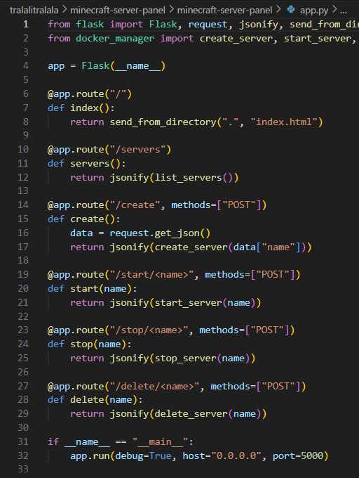
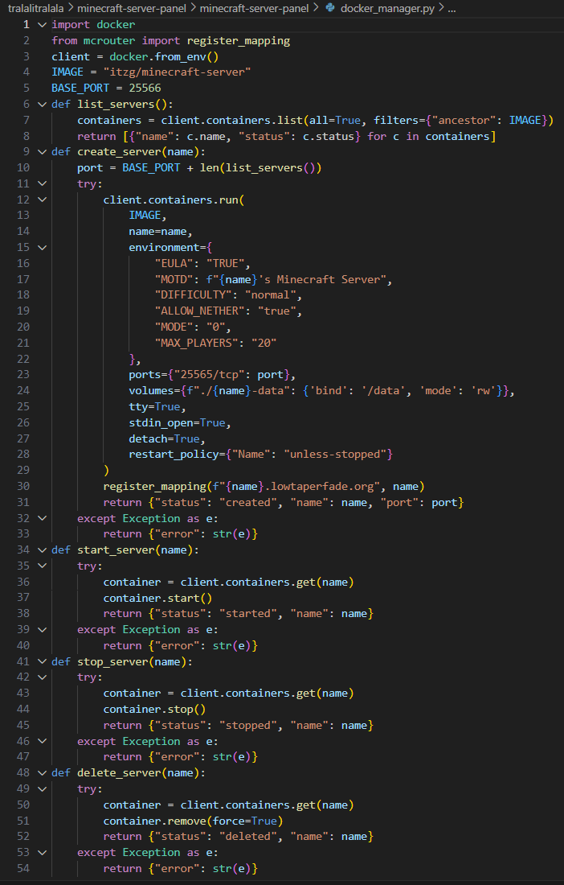
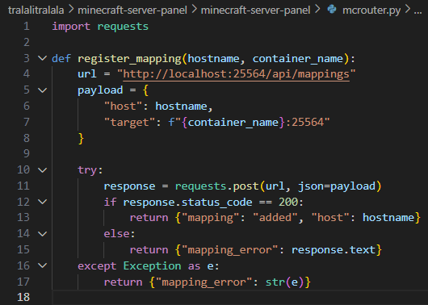
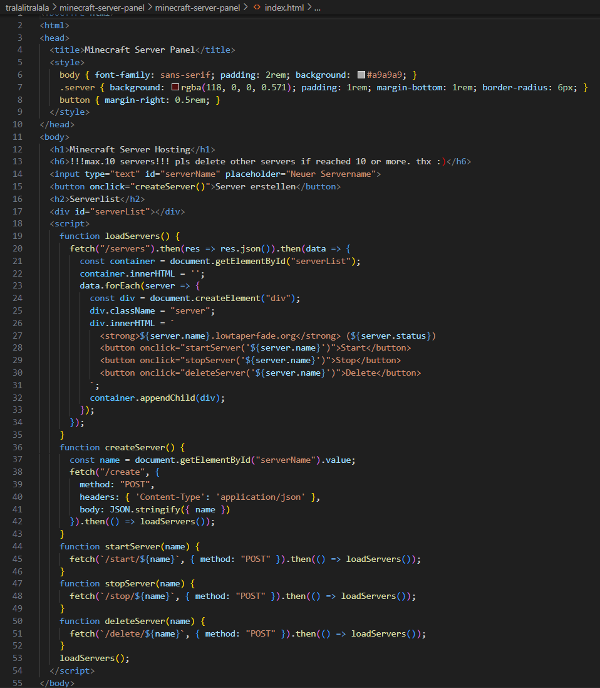

# Minecraft Docker Projekt mit Docker une Web-App
Tristan Chophel, Koichiro Möller

---
### Inhalt:

- Vorgehen
- Planung
- Umgebung (Codes, Docker, Minecraft Server)
- Was hat geklappt, was nicht
- Fazit (Was haben wir gelernt)

---

## Vorgehen

#### Brainstorming

Zum Start haben Koichiro und ich ein kurzes Brainstorming gemacht, um zu entscheiden, welches Projekt wir umsetzen wollen. Dabei haben wir uns Fragen gestellt wie:
Was wollen wir machen? Was ist einfach für uns umzusetzen? Woran haben wir Spass? Was ist machbar?

Wir sind dann zu dem Entschluss gekommen, dass folgende Projektideen für uns infrage kommen:

- Wetter-API mit Web-GUI und E-Mail-Versand
- To-Do-Liste mit Web-GUI
- Minecraft-Server mit Docker hosten
- Notiz-App

Zu jeder dieser Ideen haben wir recherchiert, was man dafür alles benötigt, z.B. Plugins oder APIs. Nach dem Brainstorming haben wir uns zunächst für die Wetter-API entschieden und angefangen, das Projekt zu planen.

Da wir schon einmal ein ähnliches Projekt umgesetzt hatten, dachten wir, dass wir damit schnell vorankommen würden. Doch nach etwa einer Woche haben wir das Projekt noch einmal gemeinsam reflektiert und gemerkt, dass uns etwas fehlt: der Spassfaktor.

Deshalb haben wir uns neu zusammengesetzt und entschieden, lieber eine Minecraft-Server-Hosting-Webseite zu entwickeln, ein Projekt, das uns mehr interessiert und mit dem wir mit einer Technik arbeiten können, die wir spannend finden.

Nach dieser Entscheidung haben wir begonnen, intensiver über dieses Projekt zu recherchieren und sind dabei auf itzg gestossen. Damit ging es dann direkt in die Planungsphase…

---

## Planung


Beim Planen unseres Projekts sind wir auf das GitHub-Repository von **itzg** gestossen, welches eine gut dokumentierte Anleitung bietet, wie man einen Minecraft-Server mithilfe von Docker einfach und zuverlässig hosten kann. Die Dokumentation von itzg gab uns eine solide technische Grundlage, auf der wir unser Projekt aufbauen können.

Unser Hauptziel ist es, **mehrere Minecraft-Server über eine Weboberfläche zu verwalten**. Dabei soll die gesamte Steuerung – also **Server erstellen, starten, stoppen und löschen** – einfach über den Browser erfolgen. Die **technische Komplexität im Hintergrund**, wie zum Beispiel Docker-Kommandos, soll vollständig ausgeblendet werden, damit der Nutzer auf einfache Weise einen Minecraft-Server hosten kann.

Nochmals zusammengefasst, damit man klar sieht, was wir alles brauchen:

* **Hauptziel:** Verwaltung mehrerer Minecraft-Server via Docker und Web
* **Web-Oberfläche entwickeln**
* **Ziel:** Einfache Steuerung (Server erstellen, starten, stoppen, löschen) über den Browser

---

## Umgebung


### app.py


### Was macht der Code?

Der Code stellt eine **Web-API** zur Verfügung. Über diese API können wir:

* Server **erstellen**
* Server **starten**
* Server **stoppen**
* Server **löschen**
* Alle Server **anzeigen**

### Die wichtigsten Teile erklärt:

* **`@app.route("/")`**
  Öffnet die Startseite (z. B. unser Web-Frontend mit Buttons).

* **`/servers`**
  Gibt eine Liste aller Server zurück.

* **`/create`**
  Erstellt einen neuen Minecraft-Server. Dafür muss man den Namen im JSON-Format senden, z. B. `{"name": "mc1
"}`.

* **`/start/<name>`**
  Startet den Server mit dem angegebenen Namen.

* **`/stop/<name>`**
  Stoppt den Server mit dem angegebenen Namen.

* **`/delete/<name>`**
  Löscht den Server mit dem angegebenen Namen.

### Verbindung zu Docker

Die ganzen Befehle (Server starten, stoppen usw.) werden in einer separaten Datei (`docker_manager.py`) erledigt. Dort wird Docker direkt angesprochen.

---


### docker_manager.py


### Was macht der Code?

Diese Datei ist dafür da, die Minecraft-Server mit **Docker** zu steuern. Alle wichtigen Funktionen wie **erstellen**, **starten**, **stoppen** und **löschen** werden hier gemacht.

### Verbindung zu Docker
```python
client = docker.from_env()
```
Das ist die Verbindung zu Docker. Damit können wir Container erstellen, starten usw.

### Liste aller Server
```python
def list_servers():
    ...
```
Diese Funktion gibt eine Liste aller Minecraft-Server (Container) zurück. Man sieht, wie sie heissen und ob sie gerade laufen.

### Server erstellen

```python
def create_server(name):
    ...
```
Diese Funktion erstellt einen neuen Minecraft-Server mit dem gewünschten Namen.
Dabei wird automatisch ein Port vergeben (25566, 25567, …), damit es keine Konflikte gibt.
Der Server bekommt auch eigene Einstellungen wie z.B. Schwierigkeitsgrad und MOTD (Nachricht im Spiel).

Der Server speichert seine Daten im Ordner `./[name]-data` – so bleibt alles erhalten, auch nach einem Neustart.

### Server starten

```python
def start_server(name):
    ...
```
Startet den gewünschten Server (Container). Ideal, wenn man ihn vorher gestoppt hat.

### Server stoppen
```python
def stop_server(name):
    ...
```
Stoppt den Server, aber löscht ihn nicht. So kann man ihn später wieder starten.

### Server löschen
```python
def delete_server(name):
    ...
```
Löscht den Server (also den Docker-Container) komplett.
### Domain registrieren
```python
register_mapping(...)
```
Diese Zeile sorgt dafür, dass der Server auch über eine Subdomain wie `mc1.lowtaperfade.org` erreichbar ist.

---


### mcrouter.py



### Was macht der Code?
Diese Datei macht, dass man den Minecraft-Server **über eine eigene Subdomain** (z.B. `mc1.lowtaperfade.org`) erreichen kann.

### Was macht die Funktion `register_mapping()`?
Sie **schickt eine Nachricht** an den Minecraft-Router (läuft auf Port `25564`) und sagt:
> „Hey, leite `mc1.lowtaperfade.org` auf meinen Container weiter!“

### Was wird gesendet?
Die Funktion baut eine kleine Nachricht:
* **`host`** → Der Name der Domain (z.B. `mc1.lowtaperfade.org`)
* **`target`** → Wohin es gehen soll (z.B. `mc1:25564`)

Dann wird das an den Router geschickt.

### Kurz gesagt:

Diese Funktion sorgt dafür, dass du deinen Server **mit Namen statt Port** erreichst – viel einfacher für alle Spieler

Die **Domain-Weiterleitung** mit dem **mcrouter** hat bei uns leider nicht funktioniert. Wir haben vieles ausprobiert, wie z.B. den Code geändert, ChatGPT gefragt, im Internet gesucht, aber trotzdem keine Lösung gefunden.
Wieso es nicht ging, wissen wir es bis heute nicht genau.
Trotz dieses Fehlers kann man den Server über die IP-Adresse erreichen mit der richtigen Port.

---

### index.html


## Was macht der Code?
Das ist deine **Weboberfläche**, also die Website, mit der du Minecraft-Server starten, stoppen, löschen oder erstellen kannst direkt im Browser.

## Aufbau:

### `HTML`-Teil:
* Zeigt eine Überschrift: **"Minecraft Server Hosting"**
* Textfeld zum Eingeben eines Servernamens
* Button: **"Server erstellen"**
* Eine Liste, wo alle Server angezeigt werden (`#serverList`)


### `CSS`-Teil (im `<style>`-Tag):
* Macht die Seite schöner: grauer Hintergrund, rote Server-Karten, runde Ecken usw.


### `JavaScript`-Teil (im `<script>`-Tag):
Das ist der Teil, der die Seite "lebendig" macht:

#### Funktionen:

* **`loadServers()`**
  Holt alle Server vom Backend (`/servers`) und zeigt sie in der Liste an.

* **`createServer()`**
  Holt den Namen aus dem Eingabefeld, schickt ihn ans Backend (`/create`) und lädt danach die Serverliste neu.

* **`startServer(name)`**
  Schickt den Start-Befehl an das Backend → `/start/name`

* **`stopServer(name)`**
  Stoppt den Server → `/stop/name`

* **`deleteServer(name)`**
  Löscht den Server → `/delete/name`

---

### Was passiert beim Laden der Seite?
Ganz unten steht:

```js
loadServers();
```

Das bedeutet: **Beim Laden der Website** wird automatisch die Liste mit allen Minecraft-Servern angezeigt.

### Kurz gesagt:

Diese Website ist dein **Minecraft Control Panel**, das mit deinem Flask-Backend spricht.
Du kannst damit ganz einfach Server **erstellen, starten, stoppen und löschen** – ohne Terminal.

---
## Fazit

### Was haben wir gelernt?

In diesem Projekt haben wir viel Neues gelernt. Wir haben zum ersten Mal mit Docker-Containern gearbeitet. Das bedeutet, dass wir unseren Minecraft-Server nicht einfach normal gestartet haben, sondern ihn in einem Container laufen lassen. So kann man den Server viel leichter starten, stoppen und verwalten – fast wie in einer Box, die alles enthält, was der Server braucht.

Ausserdem haben wir gelernt, wie Docker mit dem Internet und Webseiten zusammenarbeitet. Wir haben nämlich auch eine Web-Oberfläche gebaut. Darüber kann man die Minecraft-Server ganz einfach verwalten. Man kann sie starten, stoppen und sieht, ob sie gerade laufen – alles über den Browser, ohne Befehle schreiben zu müssen.

Ein weiteres wichtiges Thema war Netzwerke. Damit unser Server, Docker und die Webseite miteinander reden können, mussten wir verstehen, wie Netzwerke funktionieren. Jetzt wissen wir besser, was Ports sind, wie IP-Adressen funktionieren und wie man alles so einstellt, dass es miteinander verbunden ist.

Am Ende haben wir alles so aufgebaut, dass der Minecraft-Server automatisch im Docker läuft, und man ihn ganz bequem über die Webseite verwalten kann.